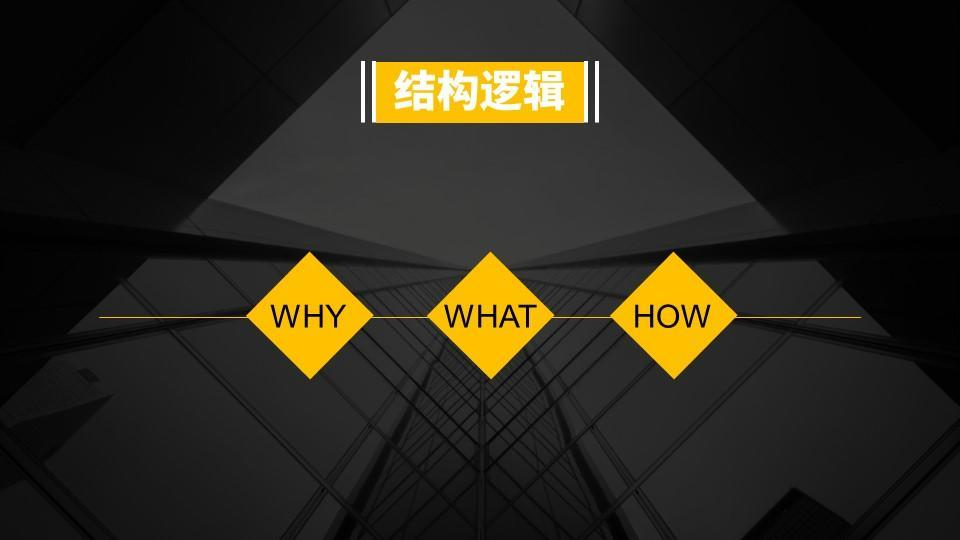

* content
{:toc}


> 一直想开始写,但每次都是刚准备,就没有下完的.主要还是没有一个清晰的思路和逻辑.
> 正好,在网上学到了几种方法,也可以认为是一个模板,记下来,先套上去用用.

# 问题
>+ 写着写着,突然写不下去了
>+ 被外界打断了,不知道怎么写下去
>+ 写完之后,逻辑不通发现自己都看不懂

那么一旦脑子里有了清晰完整的逻辑,这类问题,即将迎刃而解了.如何做到呢?

----

# SCAQ结构


<!--   -->

第一次看到这个SCAQ结构的时候,眼前一亮,确实是个很实用的办法.当然,无论多么好的思路,也需要花时间去实践.
不然也没有什么用处.

**举例:**

```
S：我们都知道最近发生了……

C：但是这与我们的……目标有所冲突

Q：现在的当务之急是需要在……时间内解决

A：我们的解决方案建议是……
```

**SCAQ结构既解答了事情重要性，抓住听众的注意力，又提供了解决方案，非常适合做工作汇报。**

----

# 2W1H
2W1H是下面的5W2H的简化版,有时候也只需要这么简单就能做好呢，

<!--  -->

+ Why :为什么要这样做
+ What :这是什么
+ How :如何达到目标

简单来说，就是为什么是什么怎么办。俗话说**大道至简**,要想运用好这些简单的办法，需要在生活中留心留意的去思考和实践。

----

# 5W2H


+ WHAT——是什么？目的是什么？做什么工作？
+ HOW ——怎么做？如何提高效率？如何实施？方法怎样？
+ WHY——为什么？为什么要这么做？理由何在？原因是什么？造成这样的结果为什么？
+ WHEN——何时？什么时间完成？什么时机最适宜？
+ WHERE——何处？在哪里做？从哪里入手？
+ WHO——谁？由谁来承担？谁来完成？谁负责？
+ HOW MUCH——多少？做到什么程度？数量如何？质量水平如何？费用产出如何？


# 金字塔原理
未完待续...
